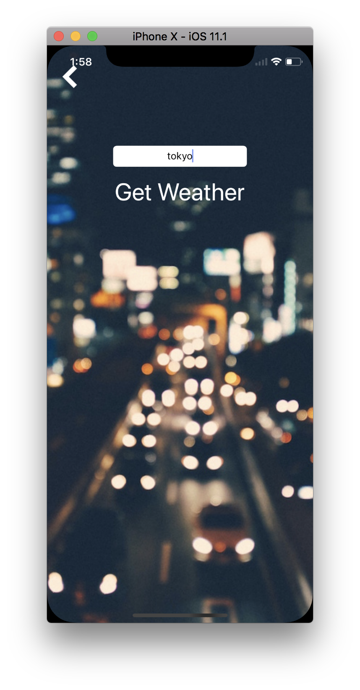
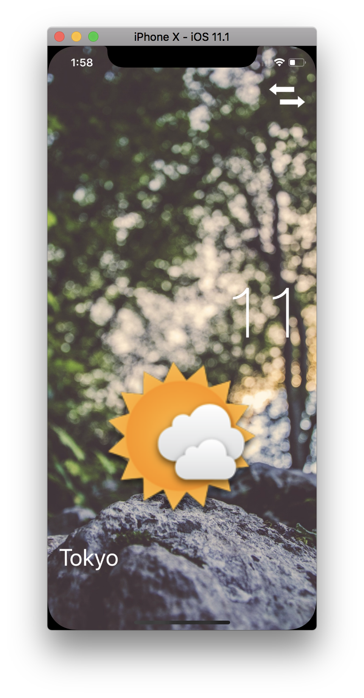

### Xylophone
I've been downloaded from here:
> https://github.com/londonappbrewery/Clima-iOS11

##### setupd

###### install&setup cocoapods

```
$ sudo gem install cocoapods
$ pod setup --verbose
```

###### initialize pod file

```
$ pod init
$ open -a Xcode Podfile
```

###### adding pod names

```
# Uncomment the next line to define a global platform for your project
# platform :ios, '9.0'

target 'Clima' do
# Comment the next line if you're not using Swift and don't want to use dynamic frameworks
use_frameworks!

# Pods for Clima

pod 'SwiftyJSON'
pod 'Alamofire'
pod 'SVProgressHUD'

end
```

###### hit pod install
```
$ pod install

Analyzing dependencies
Downloading dependencies
Installing Alamofire (4.7.0)
Installing SVProgressHUD (2.2.5)
Installing SwiftyJSON (4.0.0)
Generating Pods project
Integrating client project

[!] Please close any current Xcode sessions and use `Clima.xcworkspace` for this project from now on.
Sending stats
Pod installation complete! There are 3 dependencies from the Podfile and 3 total pods installed.
```
##### result

|[WeatherViewController.swift](Clima-iOS11/Clima/WeatherViewController.swift)|[ChangeCityViewController.swift](Clima-iOS11/Clima/ChangeCityViewController.swift)|
|:-:|:-:|
|||


