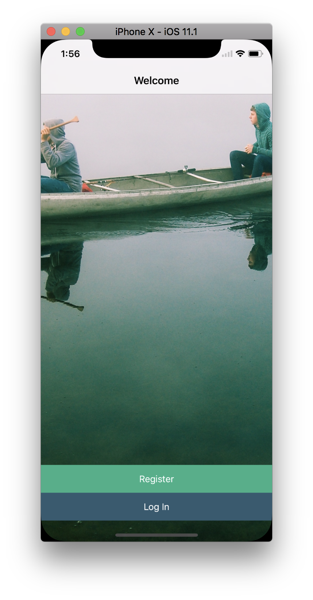
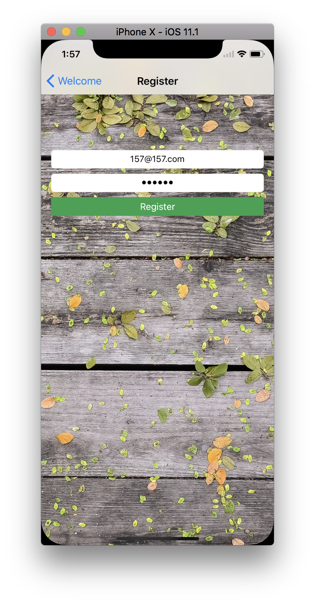
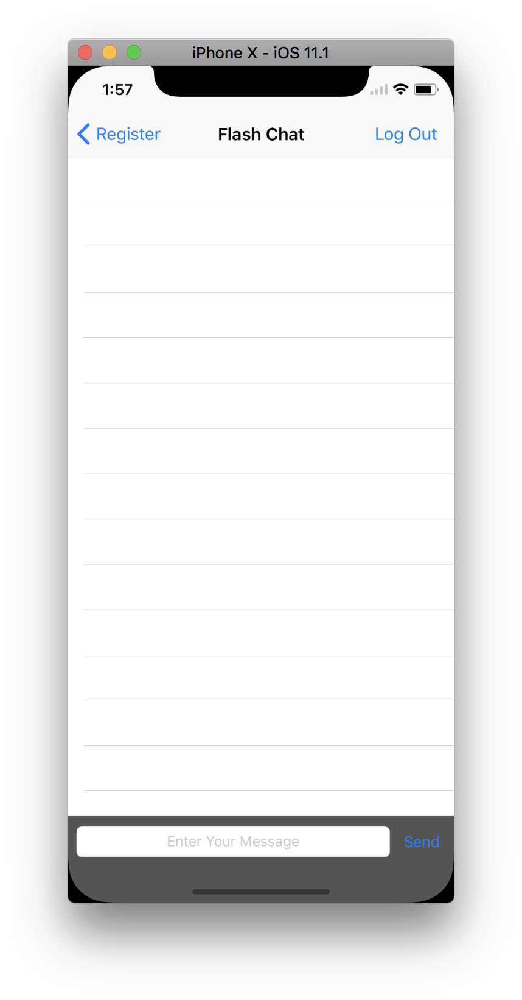

### Xylophone
I've been downloaded the Skeleton Project from here:
> https://github.com/londonappbrewery/Flash-Chat-iOS11

##### setupd

###### initialize pod file

```
$ pod init
$ open -a Xcode Podfile
```

###### adding pod names

```
# Uncomment the next line to define a global platform for your project
# platform :ios, '9.0'

target 'Flash Chat' do
# Comment the next line if you're not using Swift and don't want to use dynamic frameworks
use_frameworks!

# Pods for Flash Chat
pod 'Firebase'
pod 'Firebase/Auth'
pod 'Firebase/Database'
pod 'SVProgressHUD'
pod 'ChameleonFramework'

end
```

###### hit pod install
```
$ pod install
Analyzing dependencies
Downloading dependencies
Installing ChameleonFramework (2.1.0)
Installing Firebase (4.10.1)
Installing FirebaseAnalytics (4.1.0)
Installing FirebaseAuth (4.4.4)
Installing FirebaseCore (4.0.17)
Installing FirebaseDatabase (4.1.5)
Installing FirebaseInstanceID (2.0.9)
Installing GTMSessionFetcher (1.1.14)
Installing GoogleToolboxForMac (2.1.3)
Installing SVProgressHUD (2.2.5)
Installing leveldb-library (1.20)
Installing nanopb (0.3.8)
Generating Pods project
Integrating client project

[!] Please close any current Xcode sessions and use `Flash Chat.xcworkspace` for this project from now on.
Sending stats
Pod installation complete! There are 5 dependencies from the Podfile and 12 total pods installed.
```

##### result

|[WelcomeViewController.swift](Flash-Chat-iOS11/Flash Chat/WelcomeViewController.swift)|[RegisterViewController.swift](Flash-Chat-iOS11/Flash Chat/RegisterViewController.swift)|[ChatViewController.swift](Flash-Chat-iOS11/Flash Chat/ChatViewController.swift)|[LogInViewController.swift](Flash-Chat-iOS11/Flash Chat/LogInViewController.swift)|
|:-:|:-:|:-:|:-:|
|||||
