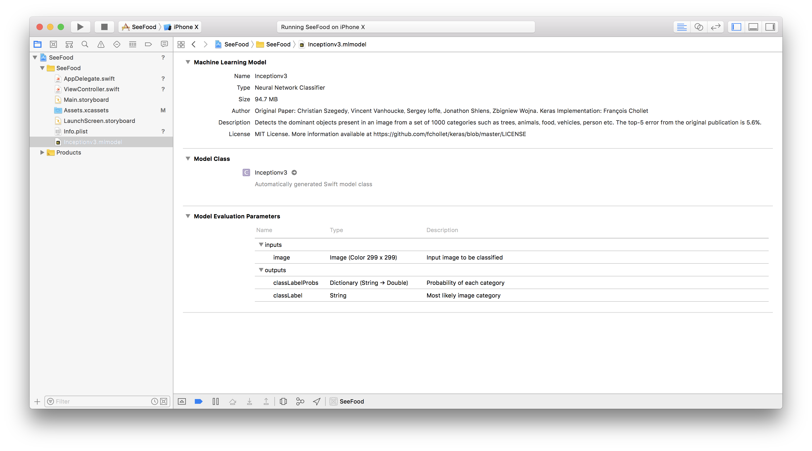
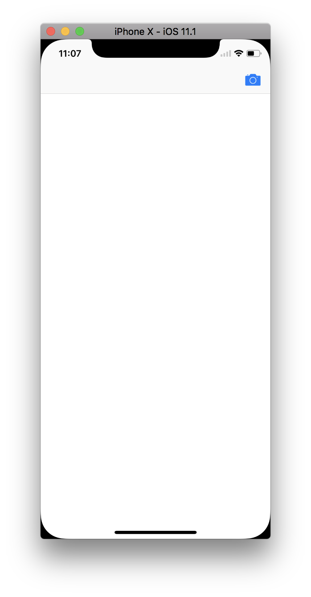
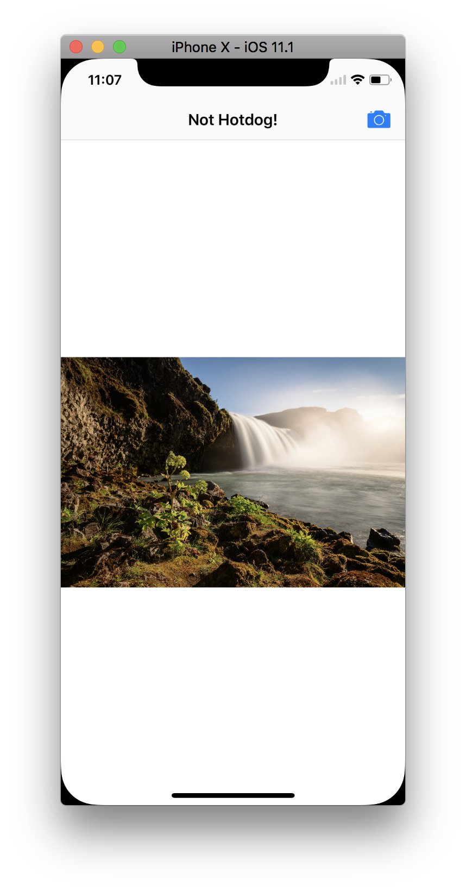
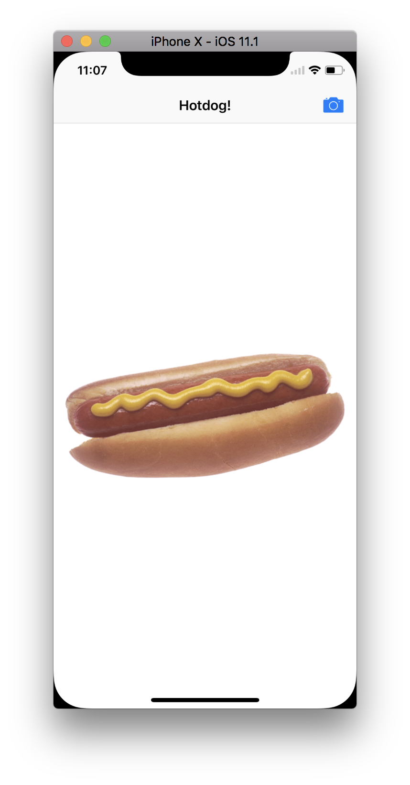

### SeeFood(: using CoreML)
I've been downloaded the V3 Model from here:
> https://developer.apple.com/machine-learning/

##### setup

###### adding mlmodel

> [Apple has provided](https://docs-assets.developer.apple.com/coreml/models/Inceptionv3.mlmodel)

|mlmodel(: my recommendation)|
|:-:|
||

##### result

||Hotdog|Not Hotdog|
|:-:|:-:|:-:|
||||
